# Backlog Synthesizer — Architecture Diagram

> Render this file in VS Code with the **Markdown Preview Mermaid Support** extension,
> or open it on GitHub / any Mermaid-aware viewer.

```mermaid
flowchart TB
    %% ─────────────────────────────────────────────────────────────────
    %% STYLE DEFINITIONS
    %% ─────────────────────────────────────────────────────────────────
    classDef ui        fill:#4A90D9,stroke:#2C5F8A,color:#fff,rx:6
    classDef auth      fill:#7B68EE,stroke:#5A4DB0,color:#fff,rx:6
    classDef input     fill:#5BAD6F,stroke:#3D8050,color:#fff,rx:6
    classDef orch      fill:#E8A838,stroke:#B07820,color:#fff,rx:6
    classDef node_box  fill:#F5C842,stroke:#B07820,color:#333,rx:4
    classDef agent     fill:#E06C3B,stroke:#A04820,color:#fff,rx:6
    classDef tool      fill:#D95F5F,stroke:#A03030,color:#fff,rx:6
    classDef provider  fill:#888,stroke:#555,color:#fff,rx:6
    classDef memory    fill:#4BACC6,stroke:#2980B9,color:#fff,rx:6
    classDef integ     fill:#70AD47,stroke:#3D8050,color:#fff,rx:6
    classDef output    fill:#5B9BD5,stroke:#2E75B6,color:#fff,rx:6
    classDef eval      fill:#9B59B6,stroke:#6C3483,color:#fff,rx:6
    classDef obs       fill:#1ABC9C,stroke:#148F77,color:#fff,rx:6
    classDef preset    fill:#F39C12,stroke:#B7770D,color:#fff,rx:4

    %% ─────────────────────────────────────────────────────────────────
    %% LAYER 0 — USER ENTRY POINTS
    %% ─────────────────────────────────────────────────────────────────
    subgraph ENTRY["  User Entry Points  "]
        direction LR
        WEB["🖥️ Streamlit Web UI\napp.py\nport 8501"]:::ui
        CLI_["⌨️ CLI\nsrc/main.py"]:::ui
    end

    %% ─────────────────────────────────────────────────────────────────
    %% LAYER 1 — AUTHENTICATION
    %% ─────────────────────────────────────────────────────────────────
    subgraph AUTH["  Authentication Layer  "]
        direction LR
        ENTRA["🔐 Microsoft Entra ID\nSSO / OAuth2\nentra_auth.py"]:::auth
        LOCAL_AUTH["🔑 Local Auth\nstreamlit-authenticator\nconfig/auth.yaml"]:::auth
    end

    %% ─────────────────────────────────────────────────────────────────
    %% LAYER 2 — INPUTS
    %% ─────────────────────────────────────────────────────────────────
    subgraph INPUTS["  Input Sources  "]
        direction LR
        TRANSCRIPT["📄 Transcripts\n.txt / .md / .pdf"]:::input
        WIKI["📋 Architecture Wiki\n.md constraints"]:::input
        BACKLOG["🎫 Existing Backlog\nJIRA / GitHub JSON"]:::input
        IMAGES["🖼️ Visual Attachments\n.png / .jpg whiteboard"]:::input
    end

    %% ─────────────────────────────────────────────────────────────────
    %% LAYER 3 — ORCHESTRATION (LangGraph)
    %% ─────────────────────────────────────────────────────────────────
    subgraph ORCH["  Orchestration Layer — LangGraph StateGraph (pipeline.py)  "]
        direction TB
        ORCH_WRAP["📦 Orchestrator\norchestrator.py\nbackward-compat wrapper"]:::orch
        PIPELINE["⚙️ build_pipeline()\nStateGraph compile\n+ MemorySaver"]:::orch
        STATE["📐 PipelineState TypedDict\nmemory/state.py\n24 typed fields"]:::orch

        subgraph NODES["  LangGraph Nodes — Fixed Linear Sequence  "]
            direction LR
            N0["1️⃣\ninitialize\n(live fetch +\naudit setup)"]:::node_box
            N1["2️⃣\nparse\n(topics from\ntranscript)"]:::node_box
            N2["3️⃣\nextract_\nconstraints"]:::node_box
            N3["4️⃣\nwrite_\nstories"]:::node_box
            N4["5️⃣\ndecompose_\nepics"]:::node_box
            N5["6️⃣\ndetect_\ngaps"]:::node_box
            N6["7️⃣\nfinalize\n(guardrails +\ntoken tally)"]:::node_box
            N0 --> N1 --> N2 --> N3 --> N4 --> N5 --> N6
        end
    end

    %% ─────────────────────────────────────────────────────────────────
    %% LAYER 4 — AGENTS
    %% ─────────────────────────────────────────────────────────────────
    subgraph AGENTS["  Agent Layer (src/agents/)  "]
        direction LR
        A1["🔍 Parser Agent\nExtract topics\n+ raw quotes\n+ summary"]:::agent
        A2["⚖️ Constraint Agent\nExtract rules\nplatform limits\ncompliance"]:::agent
        A3["✍️ Story Writer Agent\nDraft user stories\nAC + priority\nrepair + evidence"]:::agent
        A4["🏗️ Epic Decomposer\nGroup stories\ninto epics\n+ tasks"]:::agent
        A5["🔎 Gap Detector\nDuplicates\nConflicts\nCoverage gaps"]:::agent
    end

    %% ─────────────────────────────────────────────────────────────────
    %% LAYER 5 — LLM TOOLS (LangChain-backed)
    %% ─────────────────────────────────────────────────────────────────
    subgraph TOOLS["  LLM Tool Layer — LangChain Providers  "]
        direction LR
        CT["🟣 ClaudeTool\nlangchain-anthropic\nPrompt caching\nVision support"]:::tool
        GT["🔵 GeminiTool\nlangchain-google-genai\nJSON mode"]:::tool
        OT["🟢 OllamaTool\nlangchain-ollama\nLocal / offline\nformat=json"]:::tool
        ET["📊 EmbeddingTool\nsentence-transformers\nall-MiniLM-L6-v2\nlocal, no LLM cost"]:::tool
    end

    %% ─────────────────────────────────────────────────────────────────
    %% MODEL PRESETS
    %% ─────────────────────────────────────────────────────────────────
    subgraph PRESETS["  Model Presets (app.py)  "]
        direction LR
        P_LOCAL["🏠 Local\nAll Ollama\n~$0/run"]:::preset
        P_FREE["🆓 Free\nAll Gemini Flash\n~$0.01/run"]:::preset
        P_BAL["⚖️ Balanced\nGemini+Claude\n~$0.20/run"]:::preset
        P_PREM["⭐ Premium\nAll Claude Sonnet\n~$0.80/run"]:::preset
    end

    %% ─────────────────────────────────────────────────────────────────
    %% LLM PROVIDERS (external)
    %% ─────────────────────────────────────────────────────────────────
    subgraph PROVIDERS["  External LLM Providers  "]
        direction LR
        CLAUDE_API["☁️ Anthropic\nclaude-sonnet-4-5\nclaude-haiku-4-5"]:::provider
        GEMINI_API["☁️ Google AI\ngemini-2.5-flash\ngemini-2.5-pro"]:::provider
        OLLAMA_API["💻 Ollama (local)\nllama3.2:3b\nmistral / phi3"]:::provider
    end

    %% ─────────────────────────────────────────────────────────────────
    %% MEMORY & STATE LAYER
    %% ─────────────────────────────────────────────────────────────────
    subgraph MEMORY["  Memory & State Layer  "]
        direction LR
        STORE["🗄️ MemoryStore\nmemory/store.py\nKV handoff +\nvector search\nChromaDB / NPZ"]:::memory
        AUDIT_LOG["📜 AuditLog\nmemory/audit_log.py\nSQLite + SHA-256\nhash chain\ntamper-evident"]:::memory
        LANGGRAPH_STATE["🔗 LangGraph State\nMemorySaver\nin-process\nper thread_id"]:::memory
    end

    %% ─────────────────────────────────────────────────────────────────
    %% ENTERPRISE INTEGRATIONS
    %% ─────────────────────────────────────────────────────────────────
    subgraph INTEGRATIONS["  Enterprise Integrations  "]
        direction LR
        JIRA_T["🎫 JiraTool\nREST API\nLive read + publish\nMock fallback"]:::integ
        CONF_T["📖 ConfluenceTool\nREST API\nFetch wiki pages\nMock fallback"]:::integ
        MCP_T["🔗 MCP Atlassian\nmcp-atlassian server\nModel Context Protocol\nPython 3.10+"]:::integ
    end

    %% ─────────────────────────────────────────────────────────────────
    %% EXTERNAL SYSTEMS
    %% ─────────────────────────────────────────────────────────────────
    subgraph EXTERNAL["  External Systems  "]
        direction LR
        JIRA_EXT["Jira Cloud\natlassian.net"]:::provider
        CONF_EXT["Confluence Cloud\natlassian.net"]:::provider
    end

    %% ─────────────────────────────────────────────────────────────────
    %% OUTPUTS
    %% ─────────────────────────────────────────────────────────────────
    subgraph OUTPUTS["  Synthesis Outputs  "]
        direction LR
        JSON_OUT["📦 synthesis.json\nEpics / Stories / Tasks\nGaps / Conflicts\nDuplicates"]:::output
        MD_OUT["📝 synthesis.md\nHuman-readable\nMarkdown report"]:::output
        AUDIT_OUT["🔒 audit_trail.md\nFull reasoning chain\ncompliance record"]:::output
    end

    %% ─────────────────────────────────────────────────────────────────
    %% OBSERVABILITY
    %% ─────────────────────────────────────────────────────────────────
    subgraph OBS["  Observability  "]
        direction LR
        OTEL["📡 OpenTelemetry\nPer-stage spans\nOTEL_ENABLED=1\nOTLP export"]:::obs
        LOGGER["📋 Structured Logger\nlogger_setup.py\nRich console output"]:::obs
    end

    %% ─────────────────────────────────────────────────────────────────
    %% EVALUATION HARNESS
    %% ─────────────────────────────────────────────────────────────────
    subgraph EVAL["  Evaluation Harness  "]
        direction LR
        GOLDEN["🏆 10 Golden Cases\nevaluation/golden_dataset/\nnegative / conflict /\ncompliance cases"]:::eval
        METRICS["📏 Deterministic Metrics\nevaluation/metrics.py\nstory count / AC / F1"]:::eval
        JUDGE["⚖️ LLM-as-Judge\nevaluation/llm_as_judge.py\n5 quality dimensions"]:::eval
        DASH["📈 Regression Dashboard\nevaluation/dashboard.py\ndrop ≥0.10 → CI fail"]:::eval
    end

    %% ─────────────────────────────────────────────────────────────────
    %% DATA FLOW CONNECTIONS
    %% ─────────────────────────────────────────────────────────────────

    %% Entry → Auth
    WEB --> ENTRA
    WEB --> LOCAL_AUTH

    %% Entry → Orchestration
    WEB -->|"models, inputs,\noptions"| ORCH_WRAP
    CLI_ -->|"--transcript\n--wiki\n--backlog"| ORCH_WRAP

    %% Inputs → Orchestration (via input_loader.py)
    TRANSCRIPT -->|"input_loader.py"| ORCH_WRAP
    WIKI -->|"input_loader.py"| ORCH_WRAP
    BACKLOG -->|"input_loader.py"| ORCH_WRAP
    IMAGES -->|"input_loader.py"| ORCH_WRAP

    %% Orchestration internals
    ORCH_WRAP -->|"build_pipeline()\n.invoke(state)"| PIPELINE
    PIPELINE --> STATE
    PIPELINE --> NODES

    %% Presets → Orchestrator
    PRESETS -->|"resolved_models\ndict"| ORCH_WRAP

    %% Nodes → Agents (each node instantiates its agent)
    N1 -->|"ParserAgent"| A1
    N2 -->|"ConstraintAgent"| A2
    N3 -->|"StoryWriterAgent"| A3
    N4 -->|"EpicDecomposerAgent"| A4
    N5 -->|"GapDetectorAgent"| A5

    %% Agents → LLM Tools (per-stage model selection)
    A1 & A2 & A3 & A4 & A5 -->|"tool.call_for_json()"| CT
    A1 & A2 & A3 & A4 & A5 -->|"tool.call_for_json()"| GT
    A1 & A2 & A3 & A4 & A5 -->|"tool.call_for_json()"| OT
    A5 -->|"find_duplicates()"| ET

    %% LLM Tools → Providers
    CT -->|"langchain invoke\nmax_retries=3"| CLAUDE_API
    GT -->|"langchain invoke\nmax_retries=3"| GEMINI_API
    OT -->|"langchain invoke\nformat=json"| OLLAMA_API

    %% Agents ↔ Memory (adapter pattern)
    A1 & A2 & A3 & A4 & A5 -->|"memory.put(key, val)"| STORE
    STORE -->|"memory.get(key)"| A1 & A2 & A3 & A4 & A5
    STORE --> LANGGRAPH_STATE

    %% Agents → Audit
    A1 & A2 & A3 & A4 & A5 -->|"audit.record()\naudit.record_tool_call()"| AUDIT_LOG

    %% Integrations
    N0 -->|"live_confluence_page_id"| CONF_T
    N0 -->|"live_jira=True"| JIRA_T
    A5 -->|"jira.list_all()"| JIRA_T
    JIRA_T --> MCP_T
    CONF_T --> MCP_T
    JIRA_T -->|"REST API"| JIRA_EXT
    CONF_T -->|"REST API"| CONF_EXT
    MCP_T -->|"MCP"| JIRA_EXT
    MCP_T -->|"MCP"| CONF_EXT

    %% Node 6 (finalize) → guardrails → outputs
    N6 -->|"guardrails.py\nvalidation"| JSON_OUT
    N6 --> MD_OUT
    AUDIT_LOG -->|"render_markdown()"| AUDIT_OUT

    %% Observability connections
    A1 & A2 & A3 & A4 & A5 -->|"child_span()"| OTEL
    CT & GT & OT -->|"llm.call span"| OTEL
    ORCH_WRAP --> LOGGER

    %% Evaluation
    JSON_OUT -->|"compare vs expected"| GOLDEN
    GOLDEN --> METRICS & JUDGE
    METRICS & JUDGE --> DASH
```



---

## Layer Reference

| Layer | Files | Responsibility |
|---|---|---|
| **User Interface** | `app.py`, `src/main.py` | Streamlit UI + CLI entry points |
| **Authentication** | `src/entra_auth.py`, `config/auth.yaml` | Entra ID SSO + local username/password |
| **Orchestration** | `src/orchestrator.py`, `src/pipeline.py` | LangGraph StateGraph, backward-compat wrapper |
| **Agents** | `src/agents/*.py` (5 files) | Specialized reasoning per stage |
| **LLM Tools** | `src/tools/claude_tool.py`, `gemini_tool.py`, `ollama_tool.py` | LangChain-backed provider wrappers |
| **Memory** | `src/memory/store.py`, `audit_log.py`, `state.py` | KV handoff, tamper-evident audit, LangGraph state |
| **Integrations** | `src/tools/jira_tool.py`, `confluence_tool.py`, `mcp_atlassian_tool.py` | Atlassian REST + MCP |
| **Evaluation** | `evaluation/*.py` + `golden_dataset/` | Regression testing + LLM-as-judge |
| **Observability** | `src/logger_setup.py`, OpenTelemetry hooks | Structured logs + distributed tracing |

## Data Flow Summary

```
Transcript + Wiki + Backlog + Images
         │
    input_loader.py
         │
    Orchestrator.run()
         │
    LangGraph pipeline.invoke()
         │
    ┌────────────────────────────────────────────────────────┐
    │  initialize → parse → constraints → stories →          │
    │  epics → gap_detect → finalize                         │
    │                                                        │
    │  Each node: _hydrate_memory(state) → AgentX.run()      │
    │             → _extract_memory_updates(mem) → state     │
    └────────────────────────────────────────────────────────┘
         │
    guardrails.py (post-synthesis validation)
         │
    output_formatter.py
         │
    synthesis.json + synthesis.md + audit_trail.md
```
