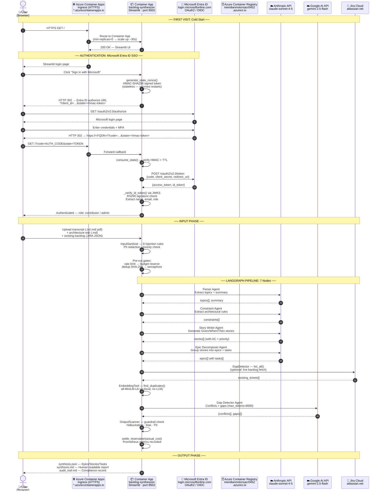
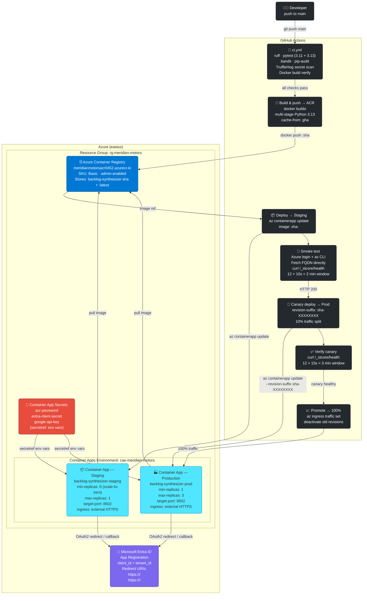
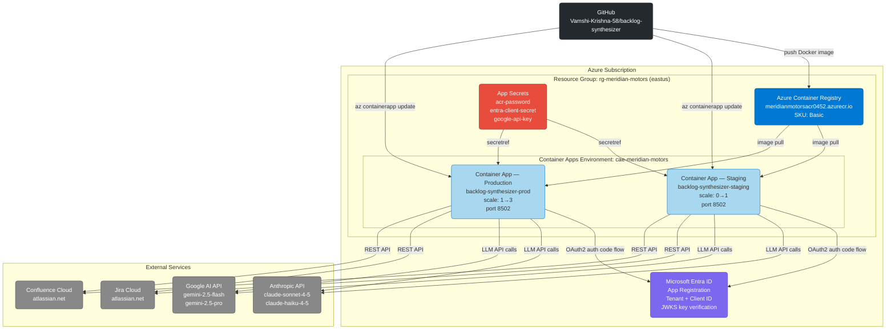

# Backlog Synthesizer — Azure End-to-End User Flow

> Render in VS Code with the **Markdown Preview Mermaid Support** extension,
> or open on GitHub / any Mermaid-aware viewer.

---

## 1. Runtime User Flow

Shows exactly what happens from the moment a user opens a browser to receiving the synthesized backlog output.

---

## 2. CI/CD Deployment Flow

Shows how a code change in GitHub becomes a running Container App on Azure.

---

## 3. Azure Resource Map

Static view of all Azure resources and how they relate.

---

## Azure Service Inventory

| Azure Service | Resource Name | Purpose |
|---|---|---|
| **Resource Group** | `rg-meridian-motors` (eastus) | Logical container for all project resources |
| **Azure Container Registry** | `meridianmotorsacr0452.azurecr.io` | Stores versioned Docker images (`:sha` + `:latest`), SKU Basic, admin-enabled |
| **Container Apps Environment** | `cae-meridian-motors` | Shared networking + compute plane for both Container Apps |
| **Container App — Staging** | `backlog-synthesizer-staging` | Pre-production app; scale-to-zero (min=0, max=1); target port 8502 |
| **Container App — Production** | `backlog-synthesizer-prod` | Live app; always-on (min=1, max=3); canary traffic splitting |
| **Microsoft Entra ID** | App Registration (tenant + client ID) | SSO via OAuth2 authorization code flow; HMAC-signed CSRF tokens; JWKS JWT verification |
| **Container App Secrets** | `acr-password`, `entra-client-secret`, `google-api-key` | Secrets injected as env vars via `secretref:` — never stored in image or workflow env |

## Key Deployment Facts

| Fact | Detail |
|---|---|
| **Trigger** | Every push to `main` → auto-deploy to staging; production requires manual `workflow_dispatch` |
| **Image tag** | `meridianmotorsacr0452.azurecr.io/backlog-synthesizer:<git-sha>` — one unique image per commit |
| **Staging scale** | `min-replicas=0` — container stops when idle; cold-start ~30s on first request |
| **Production scale** | `min-replicas=1` — always warm; up to 3 replicas under load |
| **Canary deploy** | New production revision gets 10% traffic; 3-minute health window; promotes to 100% on pass |
| **Smoke test** | Fetches staging FQDN directly via Azure CLI (not from job output, which is masked) |
| **CSRF protection** | Stateless HMAC-SHA256 signed state tokens — verified without server-side storage; survives scale-to-zero |
| **Redirect URI** | `ENTRA_REDIRECT_URI` dynamically injected from `az containerapp show … fqdn` at deploy time |
| **Secrets** | ACR password, Entra client secret, Google API key stored as Container App secrets; mounted as env vars via `secretref:` |
